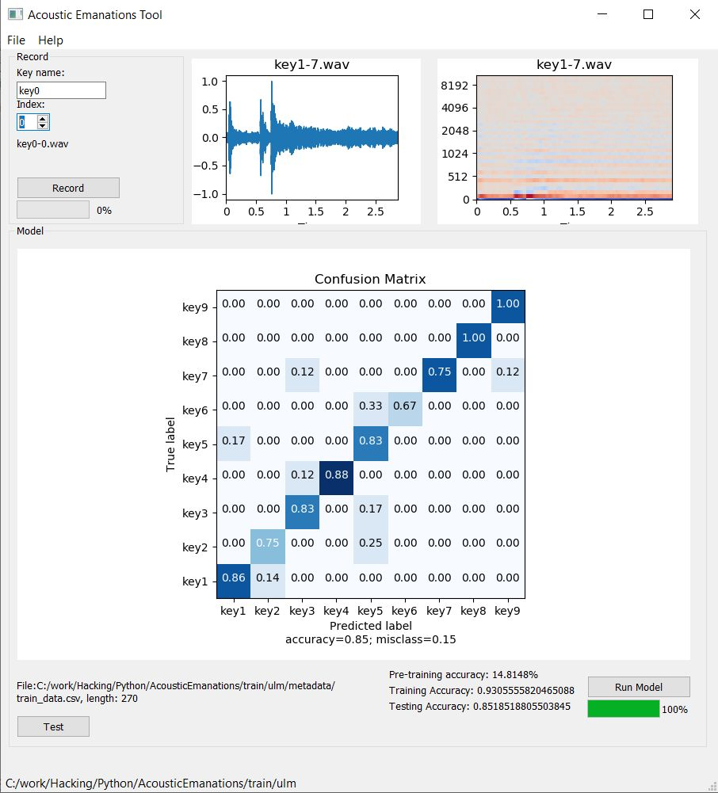

# Acoustic Emanations Tool
Experimental application for the analysis of keyboard acoustic emanations.

## About
Mechanical PIN-entry pads such as the used in secure payment terminals, ATMs, keypad lock on door, etc; can be vulnerable to attacks based on differentiating the sound emanated by different keys. The sound of button clicks can differ slightly from key to key, although the sound of clicks sound very similar to the human hear.  
Several research studies have demonstrated that it is possible to recover the typed data from the acoustic emanations.
This tool uses deep learning techniques for automatic classification of key presses sounds and verify if a keypad implementation can be vulnerable to eavesdropping.

More details are available in this [blog post entry](https://hackbeacon.blogspot.com/2020/05/acoustics-emanation-tool.html)

## License
Copyright (c) 2020, Melchor Varela - EA4FRB

Licensed under the MIT License (the "License");
you may not use this file except in compliance with the License.
You may obtain a copy of the License at [MIT License](https://opensource.org/licenses/MIT)

Development was based on [Udacity 2018 Machine Learning Nanodegree Capstone project](https://github.com/mikesmales/Udacity-ML-Capstone)

